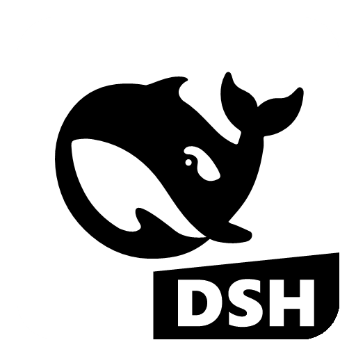

<p align="center">
  
</p>

<h1 align="center">🐋 DeepSeek Harness Desktop</h1>

<p align="center">
  一键启动 <a href="https://github.com/deepseek-ai/deepseek-harness">DeepSeek Harness</a> Web 界面的 Windows 桌面应用 —— 双击即用，无需命令行。
</p>

<p align="center">
  <a href="LICENSE"></a>
  
  
  
  
</p>

<p align="center">
  <a href="README.en.md"><b>English</b></a> | 简体中文
</p>

> 双击 `.exe` 即可运行：自动拉起 Harness Web 服务，先弹出带 DeepSeek 鲸鱼 Logo 与四步进度的启动画面，
> 再在**独立桌面窗口**中打开界面，无需再手动执行 `pnpm dsh web`、打开浏览器输入网址。

## 目录

- [特性](#特性)
- [环境要求](#环境要求)
- [快速开始（开发模式）](#快速开始开发模式)
- [生成 Windows 安装包](#生成-windows-安装包)
- [使用说明](#使用说明)
- [配置（可选）](#配置可选)
- [图标与 Logo](#图标与-logo)
- [常见问题](#常见问题)
- [实现原理](#实现原理)
- [目录结构](#目录结构)
- [相关项目](#相关项目)
- [许可证](#许可证)

<!--
截图（可选）：把截图放到 docs/screenshots/ 后，取消注释下面的代码即可展示：

## 界面预览


-->

## 特性

- **零命令行**：双击即用，自动定位 `deepseek-harness` 源码目录并启动服务（等价于 `pnpm dsh web`）。
- **启动画面**：显示 DeepSeek 鲸鱼 Logo 与「初始化 / 定位 / 启动服务 / 打开界面」四步进度（至少展示 0.9 秒）。
- **服务复用**：若 `127.0.0.1:3080` 已有健康服务，直接复用，不会重复启动。
- **单实例**：重复启动只会把已有窗口带到前台。
- **退出清理**：关闭窗口自动停止由本应用拉起的服务进程。
- **品牌图标**：白底圆角方块 + DeepSeek 鲸鱼 + 右下角 DSH 斜角标，应用于窗口、任务栏、便携版与安装版。

## 环境要求

- Windows 10 / 11
- **开发/构建**：Node.js 22+（`build.bat` 构建脚本要求）、pnpm 9+（lockfile 版本为 9.0）
- 已安装的 `deepseek-harness` 源码目录（需含 `apps/cli/src/bin.ts` 与 `node_modules`，见[配置](#配置可选)）

## 快速开始（开发模式）

```powershell
pnpm install
pnpm start        # 以开发模式直接运行
```

普通使用无需任何命令：直接双击构建好的 `.exe` 即可（见下节）。

## 生成 Windows 安装包

### 方式一：使用构建脚本（推荐）

双击运行 `build.bat`（或在 PowerShell 执行 `.\build.ps1`）。脚本会自动安装依赖、构建并嵌入图标，产物在 `release\` 目录：

| 文件 | 说明 |
| --- | --- |
| `DeepSeek-Harness-1.0.0-portable.exe` | 便携版，双击即用，无需安装 |
| `DeepSeek-Harness-Setup-1.0.0.exe` | 安装版，可创建桌面/开始菜单快捷方式，默认安装目录名 `DeepSeek Harness Desktop` |

> `build.bat` / `build.ps1` 会调用 `pnpm run build:win`，打包完成后**自动执行**
> `scripts\post-build-icon.ps1`：用 rcedit 把 DeepSeek 鲸鱼图标与版本信息嵌入主程序 exe，并重新打包 portable/安装版
> （rcedit 失败会自动重试，避免杀软/Defender 瞬时锁定文件）。

### 方式二：手动命令

```powershell
pnpm install
pnpm run build:win        # 便携版 + 安装包（含 post-build 图标嵌入）
pnpm run build:portable   # 仅便携版（不执行 post-build，主程序为默认 Electron 图标）
pnpm run build:nsis       # 仅安装版（同上）
pnpm start                # 开发模式直接运行
```

> 国内网络较慢时，可设置镜像后重试：
> ```powershell
> $env:ELECTRON_MIRROR="https://npmmirror.com/mirrors/electron/"
> $env:ELECTRON_BUILDER_BINARIES_MIRROR="https://npmmirror.com/mirrors/electron-builder-binaries/"
> ```

### 重新生成图标

修改 Logo 设计后，一键重新生成全部图标资源（需在仓库根目录执行）：

```bat
scripts\build-icons.bat
```

## 使用说明

- 双击 `DeepSeek-Harness-1.0.0-portable.exe`，先出现启动画面，随后弹出 Harness 界面（默认 `http://127.0.0.1:3080`）。
- 若端口 `3080` 已有 Harness 服务在运行，应用会自动复用，不会重复启动。
- 关闭窗口会自动停止由本应用启动的服务进程。
- 菜单「文件 → 在浏览器中打开」可在系统浏览器中打开界面；界面内的外部链接会自动用默认浏览器打开。

## 配置（可选）

首次启动后会在 `%APPDATA%\dsh-desktop\settings.json` 生成配置文件（也可通过菜单「帮助 → 打开配置文件」打开）：

```json
{
  "harnessPath": "deepseek-harness",
  "nodePath": "",
  "host": "127.0.0.1",
  "port": 3080
}
```

| 字段 | 说明 |
| --- | --- |
| `harnessPath` | deepseek-harness 源码目录（需含 `apps/cli/src/bin.ts` 与 `node_modules`）。支持三种写法：**绝对路径**（如 `C:\Program Files\DeepSeek\deepseek-harness`）、**目录名**（如 `deepseek-harness`，默认）或**尾路径**（如 `DeepSeek\deepseek-harness`）。后两种会自动在 exe/项目目录向上各级、各磁盘根目录、用户主目录、当前目录中搜索补全前面的路径 |
| `nodePath` | node.exe 路径；留空则自动探测（`node` / 常见安装位置） |
| `host` / `port` | Harness Web 服务地址（`--port 0` 可让系统分配空闲端口，但桌面端建议固定） |

也可用环境变量覆盖：`DSH_HARNESS_PATH`、`DSH_DESKTOP_PORT`、`DSH_DESKTOP_HOST`。

## 图标与 Logo

应用图标为「白底圆角方块 + DeepSeek 鲸鱼 + 右下角 DSH 斜角标」，分**蓝鲸**、**黑鲸**两个变体，默认应用**黑鲸**：

| 文件 | 说明 |
| --- | --- |
| `build/whale.svg` | DeepSeek 鲸鱼矢量来源（取自 deepseek-harness 官网 favicon） |
| `build/whale-blue.png` / `whale-black.png` | 512×512 成品 Logo（白底圆角 + DeepSeek 鲸鱼 + 斜角 DSH） |
| `build/whale-blue.ico` / `whale-black.ico` | 对应多尺寸 ICO（16–256） |
| `build/icon.png` / `build/icon.ico` | 实际打包/嵌入所用的图标（黑鲸） |
| `assets/icon.png` | 运行时图标（启动画面 Logo、窗口图标，随应用打进 asar） |

- `scripts\make-logo.ps1`：从 `whale.svg` 解析 DeepSeek 鲸鱼路径，绘制白底圆角方块、DeepSeek 鲸鱼、右下角斜角标与 DSH 文字，输出蓝/黑两版 PNG。
- `scripts\make-icon.ps1`：把 512×512 PNG 缩放出 16–256 多尺寸 ICO（BMP/DIB 条目，保留 alpha）。
- 安装版默认安装目录名 `DeepSeek Harness Desktop` 由 `build\installer.nsh` 控制。
- 注意：`make-logo.ps1` 与 `post-build-icon.ps1` 含中文注释，需以 UTF-8 带 BOM 保存（PowerShell 5.1 兼容），编辑后请保留 BOM。

## 常见问题

- **构建后任务栏/桌面图标还是旧的**：Windows 图标缓存所致，重启资源管理器（或注销重登）即可刷新。
- **构建报「rcedit 嵌入图标失败」**：通常是杀毒软件/Defender 瞬时锁定刚生成的 exe；脚本已内置最多 8 次自动重试。若仍失败，确认没有正在运行的 DeepSeek Harness 实例后重试。
- **构建日志出现 `⨯ cannot execute ... rcedit ... Unable to commit changes`**：这是 electron-builder 第一遍嵌入图标时被杀软/Defender 瞬时锁定导致，属正常现象；随后的 post-build 步骤会再次嵌入图标（最多 8 次自动重试）并重新打包，最终产物不受影响，可忽略该提示。
- **构建提示文件被占用**：构建前请先关闭正在运行的 DeepSeek Harness（它会锁定 `release\win-unpacked` 下的文件）。

## 实现原理

应用主进程（`electron/main.js`）：

1. 读取配置（`settings.json` / 环境变量），定位 harness 目录与 node 可执行文件；
2. 弹出启动画面并展示四步进度；
3. 探测目标端口是否已有健康服务，有则复用；
4. 否则拉起 `node --import tsx/esm apps/cli/src/bin.ts web`（等价于 `pnpm dsh web`），并按配置传递 `--port`；
5. 轮询等待服务就绪后，用内置窗口加载界面（窗口标题固定为 `DeepSeek Harness Desktop`）；
6. 退出时停止由本应用启动的服务；单实例锁保证重复启动只聚焦已有窗口。

## 目录结构

```
dsh-desktop-launcher/
├── electron/main.js        # Electron 主进程（启动服务 + 启动画面 + 窗口 + 菜单）
├── assets/icon.png         # 运行时图标（启动画面 Logo / 窗口图标）
├── package.json            # 依赖、脚本与 electron-builder 打包配置
├── pnpm-lock.yaml          # 锁文件（建议提交，保证依赖可复现）
├── pnpm-workspace.yaml     # pnpm 工作区配置
├── .npmrc                  # pnpm 配置（store 重定向到工作区）
├── .gitattributes          # 换行符策略（LF/CRLF 归一）
├── .gitignore
├── CHANGELOG.md            # 变更日志
├── LICENSE                 # MIT 许可证
├── README.md / README.en.md
├── build/                  # 构建资源
│   ├── whale.svg           #   DeepSeek 鲸鱼矢量来源
│   ├── whale-blue/black.png/.ico   # 蓝/黑鲸 Logo 与 ICO
│   ├── icon.png / icon.ico #   实际应用的图标（黑鲸）
│   └── installer.nsh       #   NSIS 安装目录名等定制
├── scripts/
│   ├── make-logo.ps1       # 生成 DeepSeek 鲸鱼 Logo PNG（蓝/黑两版）
│   ├── make-icon.ps1       # PNG → 多尺寸 ICO
│   ├── build-icons.bat     # 一键重新生成全部图标
│   └── post-build-icon.ps1 # 构建后嵌入图标 + 版本信息并重新打包
├── build.bat / build.ps1   # 一键构建脚本
└── release/                # 构建产物（.exe，已被 .gitignore 忽略）
```

## 相关项目

- [deepseek-ai/deepseek-harness](https://github.com/deepseek-ai/deepseek-harness) —— 本应用所启动的 Harness Web 服务本体。

## 许可证

[MIT](LICENSE) © 2026 LUX-HubCyber
